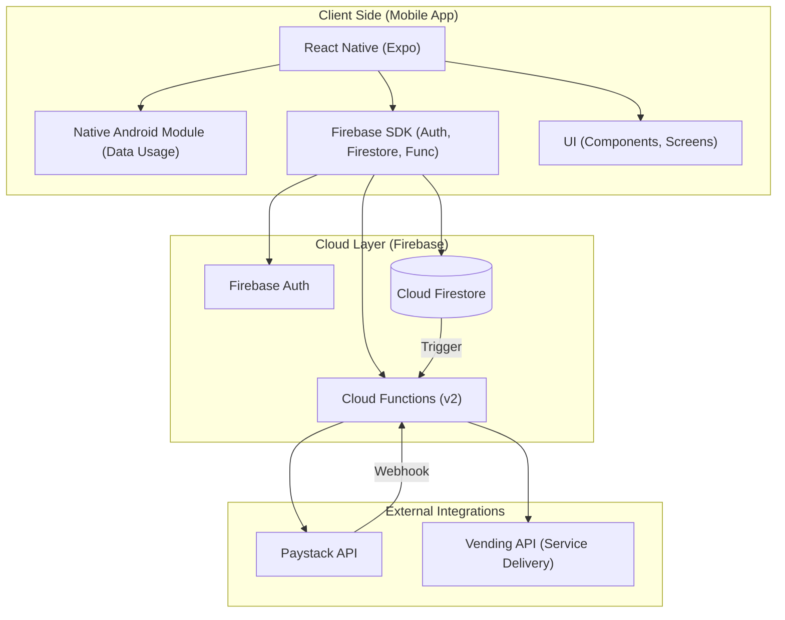
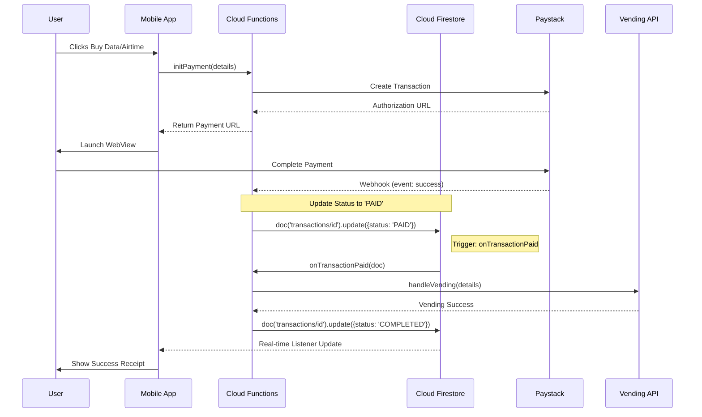

# Swift System Architecture

This document provides a high-level overview of the Swift mobile application architecture, backend infrastructure, and core data flows.

## High-Level Overview

The system is built on a modern mobile-cloud architecture, leveraging React Native for the frontend and Google Firebase for the backend.

## Core Components

### 1. Mobile Application
- **Framework**: React Native with Expo (Dev Client).
- **State & Services**: Managed via React Contexts and dedicated service classes (e.g., [firebase.ts](file:///c:/Users/Rasheed/Desktop/UI%20Design%20(5)/rn/src/services/firebase.ts)).
- **Native Modules**: Custom Android module for data usage monitoring.
- **Internationalization**: Multi-language support using `i18next`.

### 2. Backend (Firebase)
- **Authentication**: Supports anonymous and verified sign-ins.
- **Cloud Functions**: Modularized v2 functions handling payments, vending, and business logic.
- **Firestore**: Real-time NoSQL database for transactions, user profiles, and product catalogs.

## Key Data Flow: Payment & Vending

The diagram below illustrates the sequence of events from payment initialization to service delivery.

## Technology Stack

| Layer | Technology |
| :--- | :--- |
| **Frontend** | React Native, TypeScript, Expo |
| **Backend** | Node.js, Firebase (Functions, Firestore, Auth) |
| **Payments** | Paystack |
| **Styling** | Vanilla CSS (RN Stylesheet) |
| **Diagnostics** | Firebase Emulators (Local Development) |
